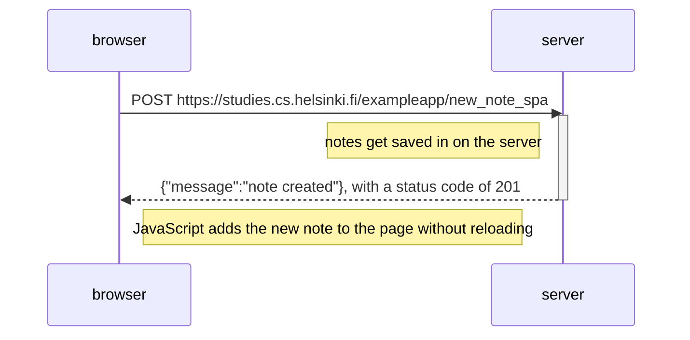

```mermaid
sequenceDiagram
    participant browser
    participant server

    browser->>server: POST https://studies.cs.helsinki.fi/exampleapp/new_note_spa
activate server
note left of server: notes get saved in on the server
server-->>browser: {"message":"note created"}, with a status code of 201
deactivate server

Note right of browser: JavaScript adds the new note to the page without reloading


```
